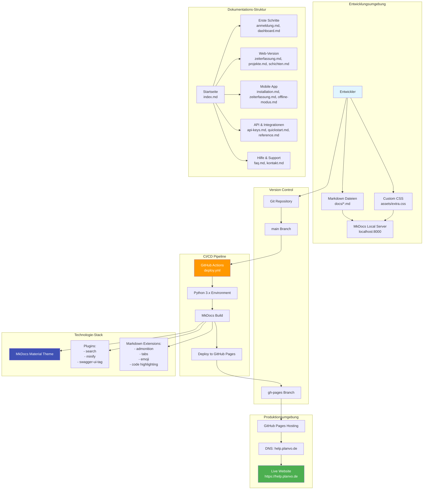
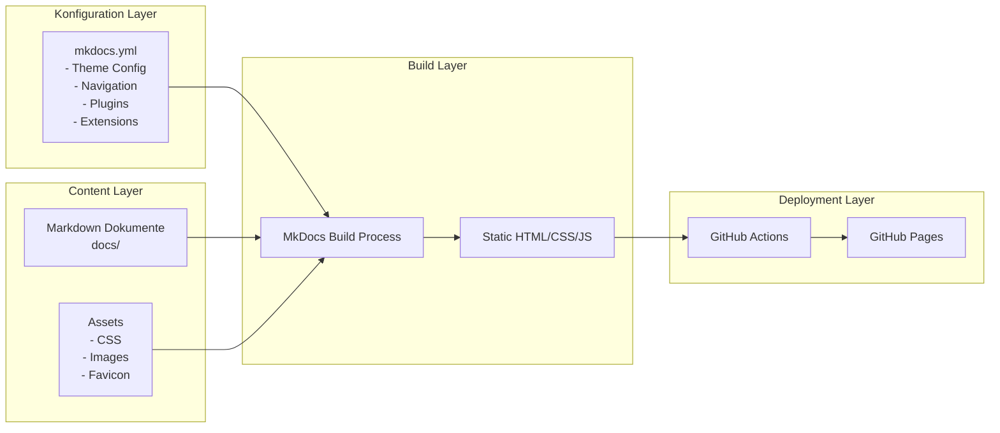
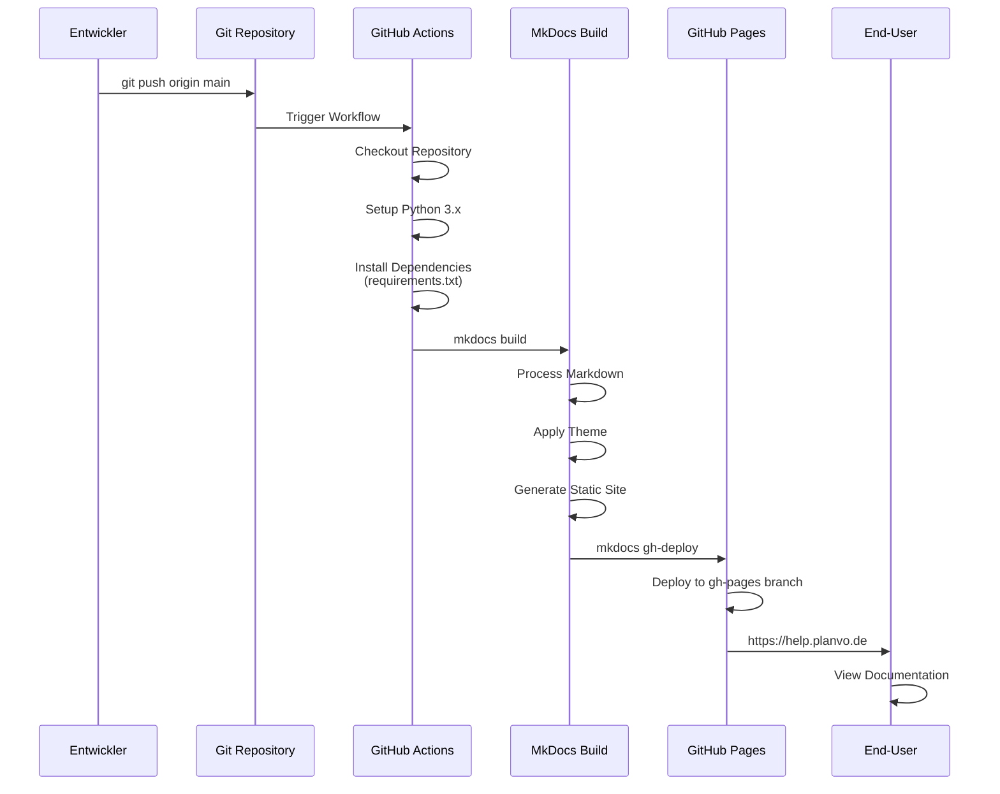
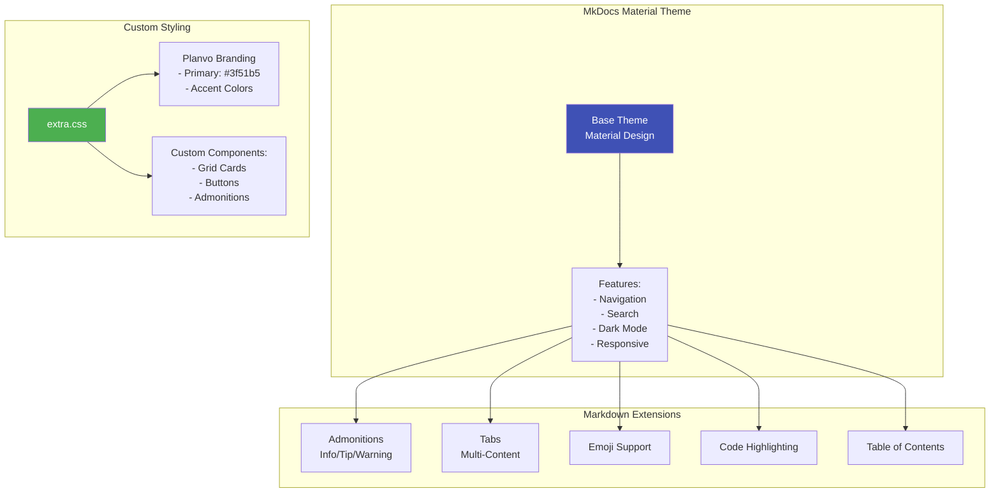
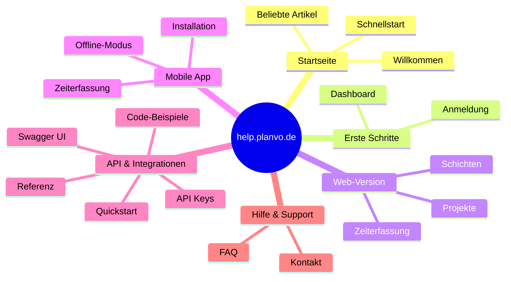

# help.planvo.de - High-Level Architektur Diagramm

## 📊 System-Übersicht

## 🏗️ Komponenten-Architektur

## 📁 Datei-Struktur

```mermaid
graph TD
    ROOT[help.planvo.de/]
    
    ROOT --> CONFIG[mkdocs.yml<br/>Hauptkonfiguration]
    ROOT --> README[README.md<br/>Projekt-Dokumentation]
    ROOT --> REQ[requirements.txt<br/>Python Dependencies]
    ROOT --> GITIGNORE[.gitignore]
    
    ROOT --> DOCS[docs/]
    DOCS --> INDEX[index.md<br/>Startseite]
    DOCS --> ASSETS[assets/]
    ASSETS --> CSS[extra.css<br/>Custom Styling]
    ASSETS --> IMG[images/<br/>Screenshots]
    ASSETS --> FAVICON[favicon.png]
    
    DOCS --> ERSTE[erste-schritte/]
    ERSTE --> ERSTE_INDEX[index.md]
    ERSTE --> ERSTE_ANM[anmeldung.md]
    ERSTE --> ERSTE_DASH[dashboard.md]
    
    DOCS --> WEB[web/]
    WEB --> WEB_INDEX[index.md]
    WEB --> WEB_ZEIT[zeiterfassung.md]
    WEB --> WEB_PROJ[projekte.md]
    WEB --> WEB_SCHICHT[schichten.md]
    
    DOCS --> MOBILE[mobile/]
    MOBILE --> MOB_INDEX[index.md]
    MOBILE --> MOB_INST[installation.md]
    MOBILE --> MOB_ZEIT[zeiterfassung.md]
    MOBILE --> MOB_OFF[offline-modus.md]
    
    DOCS --> API[api/]
    API --> API_INDEX[index.md]
    API --> API_KEYS[api-keys.md]
    API --> API_QUICK[quickstart.md]
    API --> API_REF[reference.md]
    API --> API_EX[examples.md]
    API --> API_SWAG[swagger.md]
    API --> API_YAML[openapi.yaml]
    
    DOCS --> HILFE[hilfe/]
    HILFE --> HILFE_FAQ[faq.md]
    HILFE --> HILFE_KON[kontakt.md]
    
    ROOT --> GITHUB[.github/]
    GITHUB --> WORKFLOWS[workflows/]
    WORKFLOWS --> DEPLOY[deploy.yml<br/>CI/CD Pipeline]

    style CONFIG fill:#3f51b5,color:#fff
    style DEPLOY fill:#ff9800,color:#fff
    style CSS fill:#4caf50,color:#fff
```

## 🔄 Deployment-Workflow

## 🎨 Theme & Styling Architektur

## 📚 Content-Organisation

## 🔧 Technologie-Stack Details

| Komponente | Technologie | Version | Zweck |
|------------|------------|---------|-------|
| **Build Tool** | MkDocs | ≥1.5.0 | Statische Site-Generierung |
| **Theme** | Material for MkDocs | ≥9.5.0 | UI Framework |
| **Language** | Python | 3.x | Build Environment |
| **Markdown** | Python-Markdown | - | Content Processing |
| **Deployment** | GitHub Actions | - | CI/CD Pipeline |
| **Hosting** | GitHub Pages | - | Static Site Hosting |
| **DNS** | CNAME Record | - | Custom Domain |

## 🚀 Features & Capabilities

### ✅ Implementierte Features

- **Navigation**
  - GitHub-Style Breadcrumbs
  - Sticky Navigation Tabs
  - Section-based Sidebar
  - Table of Contents (TOC)
  - Instant Navigation (kein Reload)

- **Search**
  - Volltextsuche
  - Suchvorschläge
  - Highlighting
  - Shareable Search Links

- **Content**
  - Markdown-basiert
  - Code Highlighting
  - Admonitions (Callouts)
  - Tabs für Multi-Content
  - Emoji Support
  - Responsive Images

- **UI/UX**
  - Dark/Light Mode Toggle
  - Mobile-optimiert
  - Custom Planvo Branding
  - Smooth Scrolling
  - Print Styles

- **API Integration**
  - Swagger UI für API-Dokumentation
  - OpenAPI YAML Support
  - Code Examples

### 🔄 Deployment Features

- **Automatisches Deployment**
  - Triggered bei Push auf `main`
  - Manueller Trigger möglich
  - Automatische Dependency Installation
  - Build Caching für Performance

- **Version Control**
  - Git-basiert
  - Branch-basierte Workflows
  - Edit Links zu GitHub

## 📊 Metriken & Statistiken

- **Seitenanzahl**: ~20 Dokumentationsseiten
- **Kategorien**: 6 Hauptkategorien
- **Sprache**: Deutsch
- **Build-Zeit**: ~2-3 Minuten
- **Deployment-Zeit**: ~2 Minuten nach Push
- **Technologie**: Python + MkDocs + GitHub Pages

## 🔗 Externe Abhängigkeiten

1. **GitHub**
   - Repository Hosting
   - GitHub Actions (CI/CD)
   - GitHub Pages (Hosting)

2. **Python Packages**
   - mkdocs
   - mkdocs-material
   - mkdocs-minify-plugin
   - mkdocs-swagger-ui-tag
   - pymdown-extensions

3. **DNS Provider**
   - CNAME Record für help.planvo.de

## 🎯 Zielgruppen

1. **End-User**
   - Planvo-Kunden
   - Mitarbeiter
   - Projektleiter
   - Geschäftsführung

2. **Entwickler**
   - API-Integratoren
   - Third-Party Entwickler

3. **Support-Team**
   - Interne Referenz
   - FAQ-Quelle

---

**Erstellt:** November 2024  
**Version:** 1.0.0  
**Status:** Produktiv (https://help.planvo.de)

