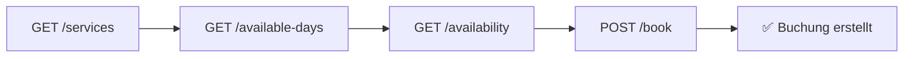

# API Playground (Swagger UI)

Interaktive API-Dokumentation zum Testen aller Endpoints direkt im Browser!

## 🎮 Interaktive API-Dokumentation

Nutzen Sie die Swagger UI unten, um:

- ✅ Alle Endpoints zu erkunden
- ✅ Request/Response Schemas zu sehen
- ✅ API-Aufrufe direkt zu testen (mit Ihrem API Key)
- ✅ Beispiel-Requests zu generieren

!!! tip "Tipp: API Key verwenden"
    Um die API zu testen, klicken Sie auf **"Authorize"** und geben Sie Ihren API Key ein:
    ```
    pk_live_your_api_key_here
    ```

---

<swagger-ui src="openapi.yaml"/>

---

## 📚 Weitere Ressourcen

- **[API-Referenz](reference.md)** - Detaillierte Dokumentation mit Code-Beispielen
- **[Schnellstart-Guide](quickstart.md)** - Integration in 5 Minuten
- **[Code-Beispiele](examples.md)** - Fertige Komponenten für alle Frameworks
- **[API Keys verwalten](api-keys.md)** - Sicherheit und Best Practices

---

## 🔒 Sicherheitshinweis

!!! warning "API Key nicht öffentlich teilen"
    Verwenden Sie zum Testen einen Test-Key oder einen Key mit niedrigen Rate Limits. Teilen Sie niemals Ihren Production API Key öffentlich!

## 💡 Wie verwende ich Swagger UI?

### 1. Authorize (Authentifizierung)

1. Klicken Sie auf **"Authorize"** (🔓 Icon oben rechts in Swagger UI)
2. Geben Sie Ihren API Key ein: `Bearer pk_live_your_key_here`
3. Klicken Sie auf **"Authorize"**
4. Schließen Sie den Dialog

### 2. Endpoint auswählen

1. Klicken Sie auf einen Endpoint (z.B. `GET /api/public/booking/services`)
2. Der Endpoint expandiert und zeigt Details

### 3. Try it out

1. Klicken Sie auf **"Try it out"**
2. Füllen Sie ggf. Parameter aus
3. Klicken Sie auf **"Execute"**
4. Sehen Sie die Response direkt darunter

### 4. Code generieren

1. Nach dem Execute sehen Sie **"Curl"**, **"Request URL"**, etc.
2. Kopieren Sie den generierten Code für Ihre Implementierung

---

## 📖 API Workflow

Typischer Ablauf einer Buchung:



1. **Services laden** - `GET /services`
2. **Verfügbare Tage** - `GET /available-days`
3. **Zeitslots** - `GET /availability`
4. **Buchen** - `POST /book`

---

**Benötigen Sie Hilfe?**

- 📧 E-Mail: [api-support@planvo.de](mailto:api-support@planvo.de)
- 💬 Live-Chat: Verfügbar im Planvo-Dashboard
- 📚 Community: [community.planvo.de](https://community.planvo.de)

