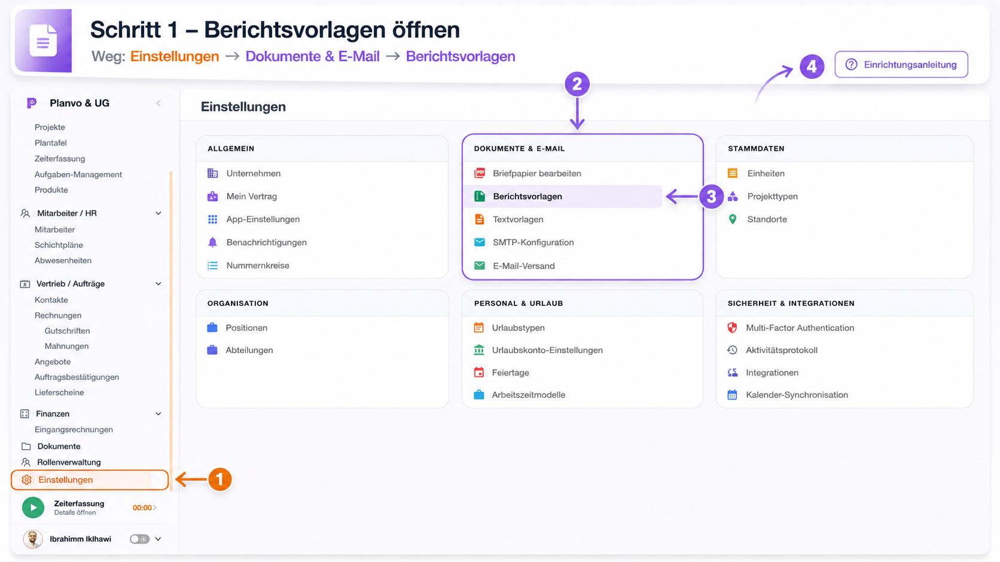
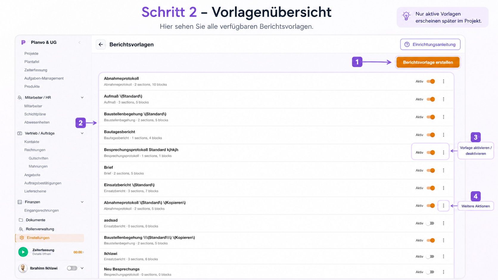
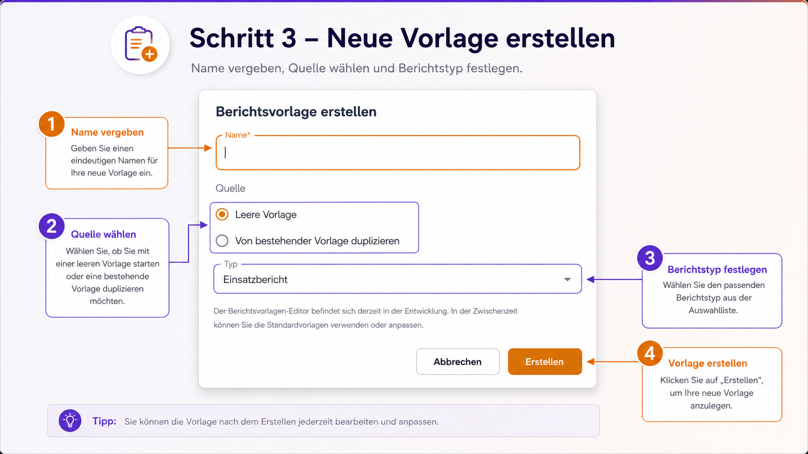
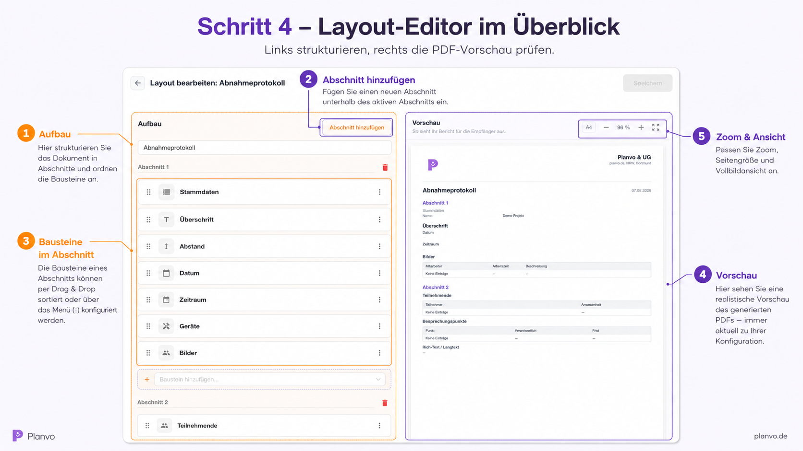
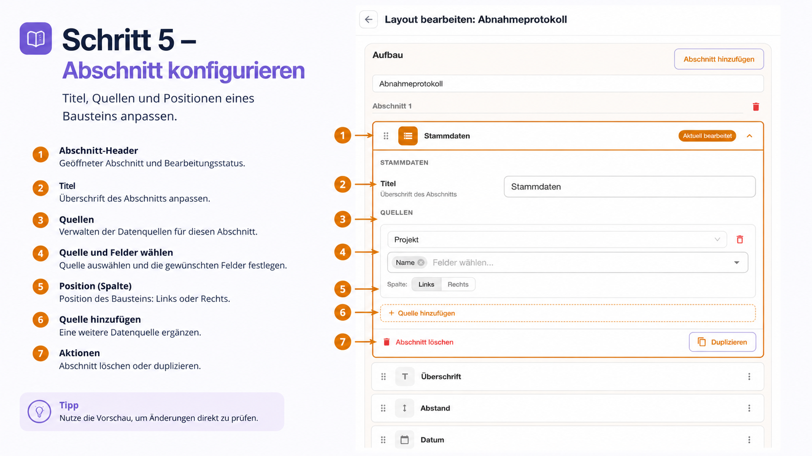
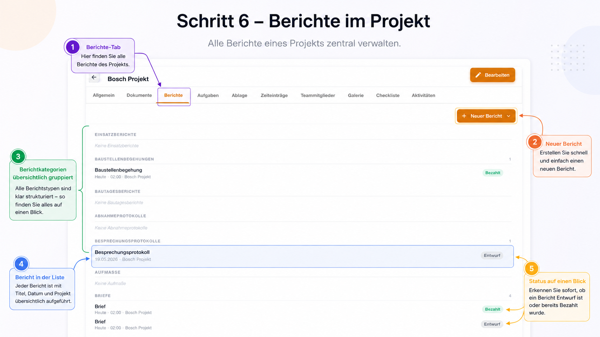
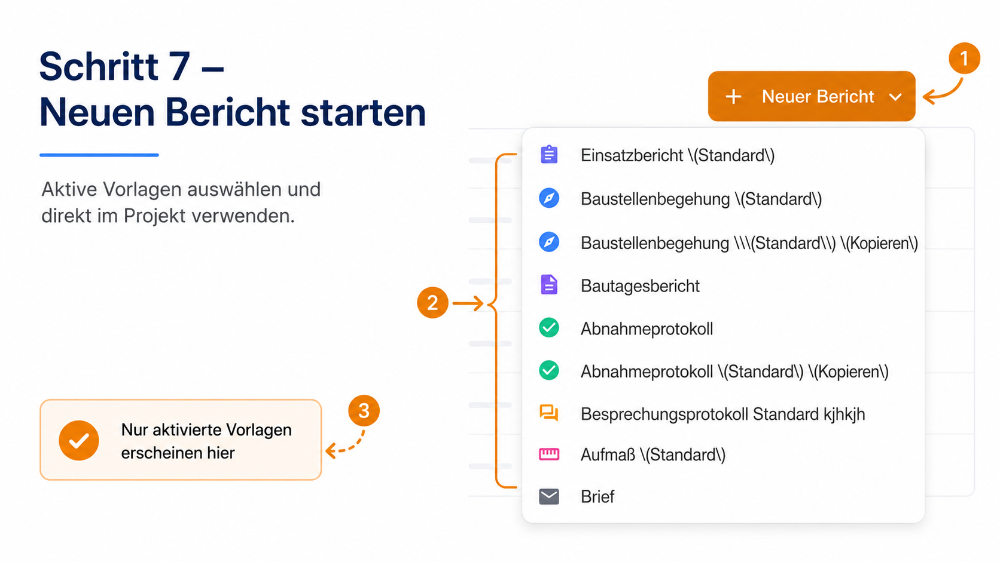
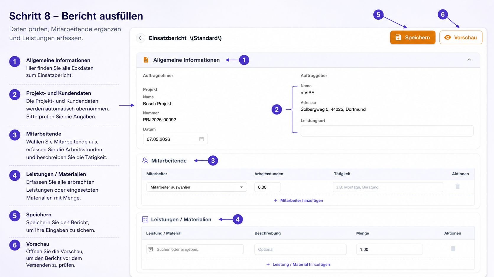
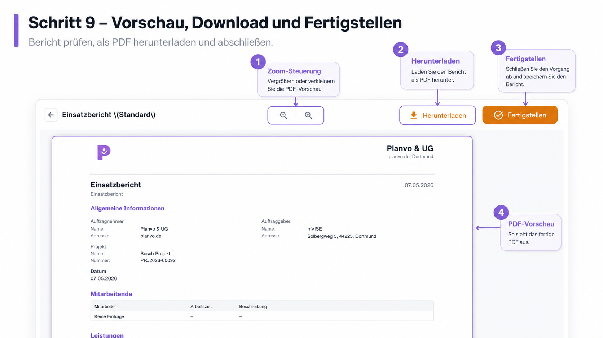

# Berichte (Web)

> **⏱️ Lesezeit:** 10 Minuten  
> **📱 Verfügbar in:** Web  
> **👤 Für:** Projektleiter, Techniker, Administratoren

---

## 📋 Was Sie in diesem Kapitel lernen

- ✅ Wo Sie Berichtsvorlagen in den Einstellungen finden und verwalten
- ✅ Wie Sie eine neue Vorlage anlegen und im Layout-Editor bearbeiten
- ✅ Wie Sie Berichte im Projekt anlegen, ausfüllen und abschließen
- ✅ Wie Sie die PDF-Vorschau nutzen, herunterladen und fertigstellen

---

## 🎯 Übersicht

Mit dem Berichtsmodul erstellen Sie **professionelle PDFs** direkt aus dem Projekt — inklusive Projektdaten, Kundendaten und Ihrem **Firmenlogo** aus den Unternehmenseinstellungen.

- **Vorlagen zentral** – Aufbau und Bausteine definieren Sie unter Einstellungen
- **Daten aus dem Projekt** – Viele Felder werden automatisch befüllt
- **PDF jederzeit** – Vorschau, Download und Abschluss in wenigen Klicks

Die folgenden neun Schritte führen Sie von den **Einstellungen** bis zum **fertigen PDF**. Zu jedem Schritt gibt es einen Screenshot mit Erklärungen.

---

## Schritt 1 – Berichtsvorlagen öffnen

**Weg:** **Einstellungen** (Seitenleiste) → Karte **„Dokumente & E‑Mail“** → **„Berichtsvorlagen“**

Optional finden Sie auch Hilfe unter **„Einrichtungsanleitung“** oben rechts auf der Einstellungsseite.

**Was Sie hier sehen:** die Übersicht **Einstellungen** mit den Karten (z. B. Allgemein, Dokumente & E‑Mail). Unter **Dokumente & E‑Mail** wählen Sie den Eintrag **Berichtsvorlagen**, um die Vorlagenverwaltung zu öffnen.

---

## Schritt 2 – Vorlagenübersicht

Nach dem Öffnen der **Berichtsvorlagen** sehen Sie die Liste aller Vorlagen.

| Bereich | Bedeutung |
|---------|-----------|
| **Berichtsvorlage erstellen** | Legt eine **neue** leere oder duplizierte Vorlage an |
| **Vorlagenliste** | Name, Kurzinfo (z. B. Anzahl Abschnitte/Bausteine) |
| **Aktiv / Inaktiv** | Nur **aktive** Vorlagen erscheinen später bei **„Neuer Bericht“** im Projekt |
| **Drei-Punkte-Menü (⋮)** | Weitere Aktionen zur jeweiligen Vorlage |

!!! tip "Merksatz"
    **Nur aktive Vorlagen** stehen Ihrem Team im Projekt zur Auswahl — inaktive Vorlagen blenden Sie gezielt aus.

---

## Schritt 3 – Neue Vorlage anlegen

Klicken Sie auf **„Berichtsvorlage erstellen“**. Es öffnet sich ein Dialog.

1. **Name*** – Ein eindeutiger Name für die Vorlage (Pflichtfeld)
2. **Quelle** – Entweder **„Leere Vorlage“** oder **„Von bestehender Vorlage duplizieren“**
3. **Typ** – Wählen Sie den passenden **Berichtstyp** aus der Liste (bestimmt die verfügbaren Bausteine und das Verhalten im Formular)
4. **Erstellen** – Legt die Vorlage an; Sie können sie danach im **Layout-Editor** bearbeiten

**Abbrechen** schließt den Dialog ohne Änderungen.

!!! tip "Tipp"
    Nach dem Anlegen können Sie die Vorlage jederzeit im Layout-Editor anpassen und speichern.

---

## Schritt 4 – Layout-Editor im Überblick

Im **Layout bearbeiten**-Modus sehen Sie zwei Bereiche: links den **Aufbau**, rechts die **PDF‑Vorschau**.

**Links – Aufbau**

- **Abschnitte** strukturieren das Dokument (Kapitel im PDF)
- Pro Abschnitt: **Bausteine** mit Symbol, Namen und **⋮**-Menü
- **Bausteine** per **Drag-Handle** (sechs Punkte) sortieren
- **„Baustein hinzufügen …“** – weiteren Baustein in diesem Abschnitt einfügen
- **Abschnitt hinzufügen** – neuen Abschnitt unterhalb einfügen

**Rechts – Vorschau**

- Zeigt das PDF so, wie es später aussehen kann (**Logo, Überschriften, Tabellen**)
- **Zoom**, **Seitengrößenauswahl** (z. B. A4) und **Vollbild** nach Bedarf

**Oben in der Leiste:** Zurück, Titel **„Layout bearbeiten: …“** und **Speichern**.

---

## Schritt 5 – Baustein konfigurieren (Beispiel: Stammdaten)

Klicken Sie auf einen Baustein (z. B. **Stammdaten**), um ihn zu bearbeiten. Die detaillierten Einstellungen erscheinen im Aufbau-Bereich.

| Nr. | Thema | Erklärung |
|-----|--------|-----------|
| 1 | **Header** | Welcher Baustein gerade bearbeitet wird (Status z. B. „Aktuell bearbeitet“) |
| 2 | **Titel** | Überschrift dieses Bausteins im PDF |
| 3 | **Quellen** | Welche Datenquellen verwendet werden (z. B. Projekt, Kunde, Unternehmen) |
| 4 | **Quelle & Felder** | Pro Quelle: welche **Felder** angezeigt werden |
| 5 | **Spalte** | Darstellung **links** oder **rechts** (zweispaltiges Layout im PDF) |
| 6 | **Quelle hinzufügen** | Weitere Datenquelle für denselben Baustein |
| 7 | **Aktionen** | Z. B. **Abschnitt löschen** oder **Duplizieren** |

!!! tip "Tipp"
    Prüfen Sie Änderungen sofort in der **rechten Vorschau** — so sehen Sie das Layout ohne den Editor zu verlassen.

---

Andere Baustein-Typen (Freitext, Checkliste, Tabellen, Aufmaß, Skizzen, Unterschrift usw.) funktionieren nach dem gleichen Prinzip: Baustein auswählen, im Aufbau die passenden Optionen setzen, Vorschau prüfen, **Speichern**.

---

## Schritt 6 – Berichte im Projekt

Öffnen Sie ein **Projekt** und wechseln Sie in den Tab **„Berichte“**.

| Bereich | Erklärung |
|---------|-----------|
| **Tab „Berichte“** | Zentrale Übersicht aller Berichte **dieses** Projekts |
| **„+ Neuer Bericht“** | Startet die Auswahl einer aktiven Vorlage |
| **Gruppierung** | Berichte können nach Typ oder Kategorie übersichtlich sortiert sein |
| **Einzelner Bericht** | Titel, Datum, Projektbezug auf einen Blick |
| **Status** | Z. B. **Entwurf** oder abgeschlossen — je nach Konfiguration weitere Stellen (Badges rechts in der Liste) |

---

## Schritt 7 – Neuen Bericht starten

Klicken Sie auf **„+ Neuer Bericht“**. Im Dropdown erscheinen alle **aktivierten** Vorlagen.

- Jede Zeile ist eine **Berichtsvorlage** (mit Icon und Namen)
- **Nur Vorlagen, die in den Einstellungen aktiv sind**, erscheinen hier

Wählen Sie die gewünschte Vorlage — es öffnet sich das **Berichtsformular**.

---

## Schritt 8 – Bericht ausfüllen

Das Formular folgt der Struktur Ihrer Vorlage: **Abschnitte** und **Bausteine** wie im Layout-Editor definiert.

**Typische Bereiche (je nach Vorlage):**

1. **Allgemeine Informationen** – z. B. Auftragnehmer, Auftraggeber, **Projekt**, **Datum**
2. **Projekt- und Kundendaten** – oft **automatisch** aus dem Projekt; bitte kurz **prüfen**
3. **Mitarbeitende** – Mitarbeiter wählen, **Arbeitsstunden** und **Tätigkeit** erfassen; Zeilen über **„Hinzufügen“** ergänzen
4. **Leistungen / Materialien** – erbrachte Leistungen oder Material mit **Menge** und Beschreibung; wieder per **„Hinzufügen“** erweiterbar

**Oben rechts:**

5. **Speichern** – sichert den Bericht (z. B. als **Entwurf**)
6. **Vorschau** – öffnet die **PDF-Vorschau** mit Ihrem Layout

Speichern Sie regelmäßig, besonders bei langen Berichten.

---

## Schritt 9 – Vorschau, Download und Fertigstellen

In der **Vorschau** sehen Sie das PDF wie für den Druck oder Versand.

| Bereich | Funktion |
|---------|-----------|
| **Zoom (− / +)** | PDF vergrößern oder verkleinern |
| **Herunterladen** | PDF auf Ihrem Gerät speichern |
| **Fertigstellen** | Bericht **abschließen**; danach ist er in der Regel nicht mehr bearbeitbar |
| **PDF-Inhalt** | Entspricht Ihrer Vorlage: Überschriften, Tabellen, Logos, automatische Felder |

**Zurück** (Pfeil oben links) bringt Sie in der Regel zurück zum **Formular**, falls Sie noch etwas korrigieren möchten.

!!! warning "Wichtig vor Fertigstellen"
    Prüfen Sie Inhalt und PDF-Vorschau. Ein **fertiggestellter** Bericht kann nicht mehr nachträglich geändert werden — **Erstellung eines neuen Berichts** ist dann die saubere Lösung bei Korrekturwünschen.

---

## Unterschriften (optional)

Wenn Ihre Vorlage **Unterschriften-Bausteine** enthält und die Oberfläche es vorsieht, können Sie **digitale Unterschriften** erfassen (z. B. nach dem Speichern eines Entwurfs). Hinweise dazu finden Sie am jeweiligen Button **„Unterschriften“** im Bericht — die genaue Position hängt vom Berichtsstatus und der Vorlage ab.

---

## 🔄 Kurze Szenarien

=== "Einsatz dokumentieren"

    1. Projekt → **Berichte** → **Neuer Bericht** → Einsatzbericht  
    2. Daten prüfen, Mitarbeiter und Leistungen eintragen  
    3. **Speichern** → **Vorschau** → **Herunterladen** oder **Fertigstellen**

=== "Vorlage neu aufsetzen"

    1. **Einstellungen** → **Dokumente & E‑Mail** → **Berichtsvorlagen**  
    2. **Berichtsvorlage erstellen** oder bestehende **duplizieren**  
    3. Im **Layout-Editor** Abschnitte und Bausteine anpassen → **Speichern** → Vorlage **aktivieren**

---

## ❓ Häufige Fragen

??? question "Warum sehe ich eine Vorlage im Projekt nicht?"
    Vermutlich ist sie **deaktiviert**. Unter **Einstellungen → Berichtsvorlagen** den Schalter auf **aktiv** setzen.

??? question "Kann ich eine Vorlage nachträglich ändern?"
    Ja. Änderungen gelten typischerweise für **neue** Berichte; bereits erstellte PDFs bleiben unverändert.

??? question "Wo kommt das Firmenlogo im PDF her?"
    Aus den **Unternehmenseinstellungen** (Logo-Upload). Ohne Logo erscheint ggf. nur Text im Kopf.

??? question "Kann ich einen fertigen Bericht noch bearbeiten?"
    In der Regel **nein** nach **Fertigstellen**. Ansonsten einen **neuen** Bericht mit derselben Vorlage anlegen.

---

## 📋 Schnell-Referenz

| Aufgabe | Weg |
|---------|-----|
| Berichtsvorlagen öffnen | **Einstellungen** → **Dokumente & E‑Mail** → **Berichtsvorlagen** |
| Neue Vorlage | **Berichtsvorlage erstellen** → Name, Quelle, Typ → **Erstellen** |
| Vorlage bearbeiten | Vorlage öffnen / Zeile klicken → **Layout bearbeiten** → **Speichern** |
| Vorlage im Projekt sichtbar | Schalter **Aktiv** in der Vorlagenliste |
| Neuen Bericht | **Projekt** → Tab **Berichte** → **+ Neuer Bericht** |
| PDF prüfen | **Vorschau** im Bericht |
| PDF speichern | **Herunterladen** in der Vorschau |
| Bericht abschließen | **Fertigstellen** in der Vorschau |
| Logo pflegen | **Einstellungen** → Unternehmen / Firmendaten → Logo |

---

## 🆘 Brauchen Sie Hilfe?

-   :material-chat:{ .lg } **Live-Chat**

    ---

    Schnelle Antworten während der Geschäftszeiten

    [Chat öffnen](https://www.planvo.de)

-   :material-email:{ .lg } **E-Mail Support**

    ---

    Detaillierte Anfragen per E-Mail

    [support@planvo.de](mailto:support@planvo.de)

---

*Letzte Aktualisierung: Mai 2026 | Version 2.1 (9-Schritte-Anleitung mit Screenshots)*
