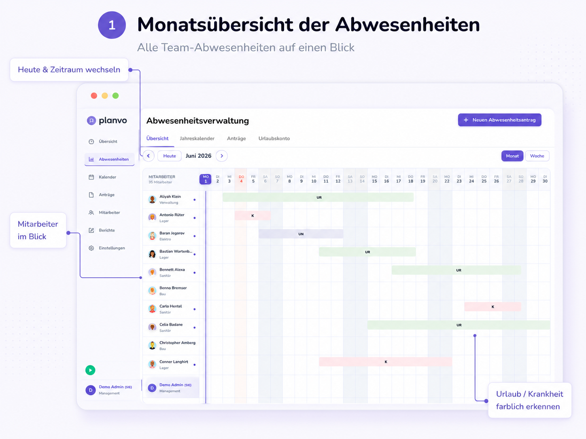
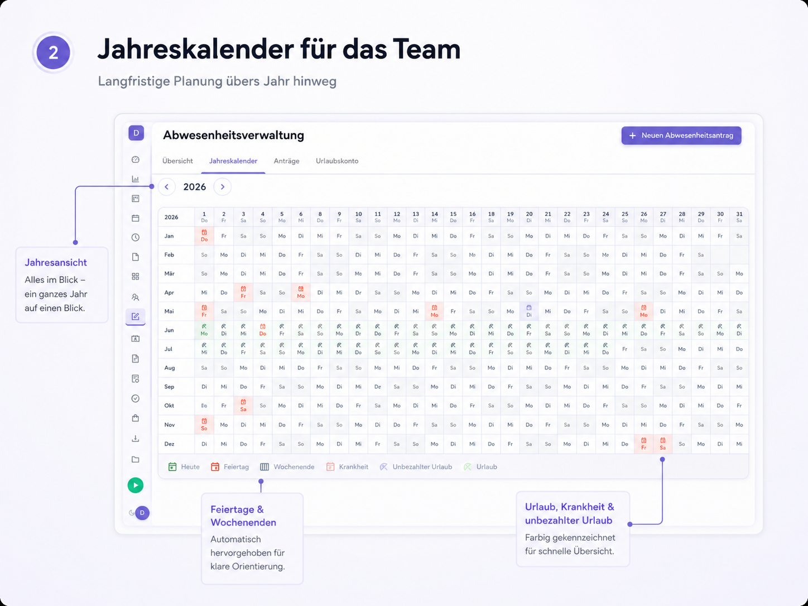
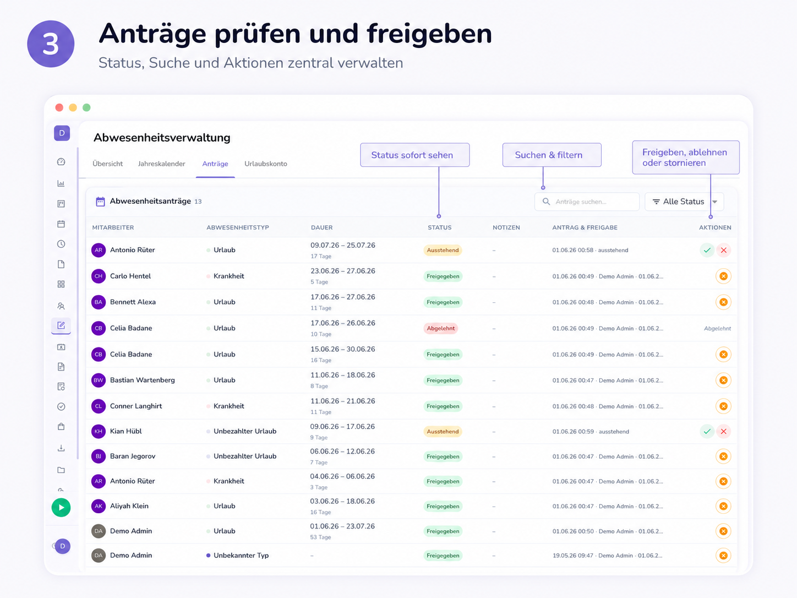
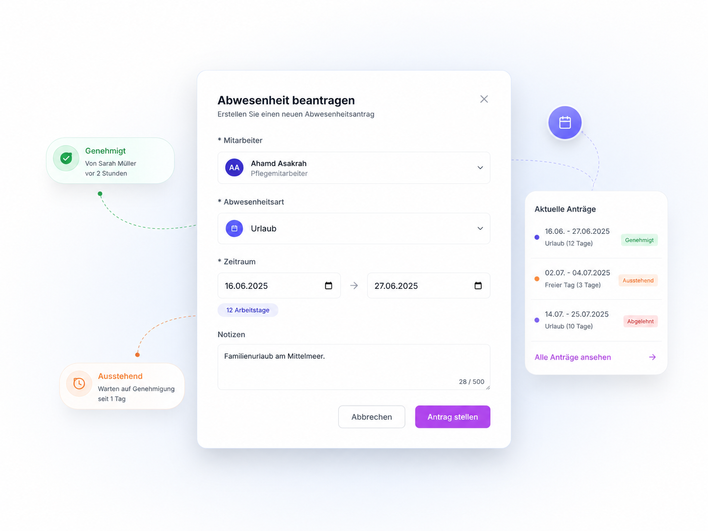
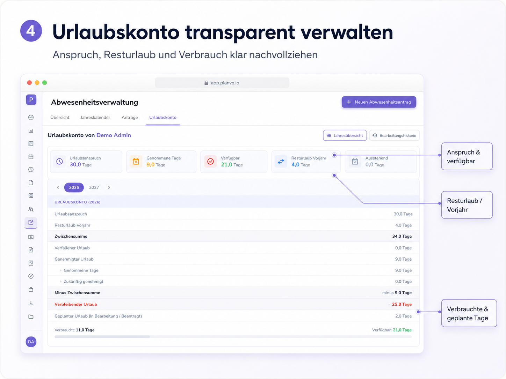
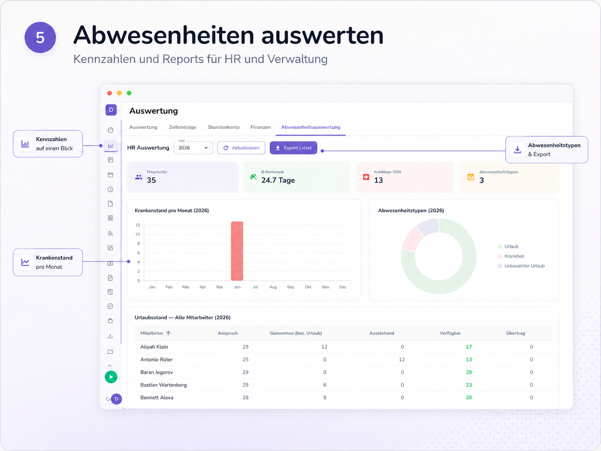
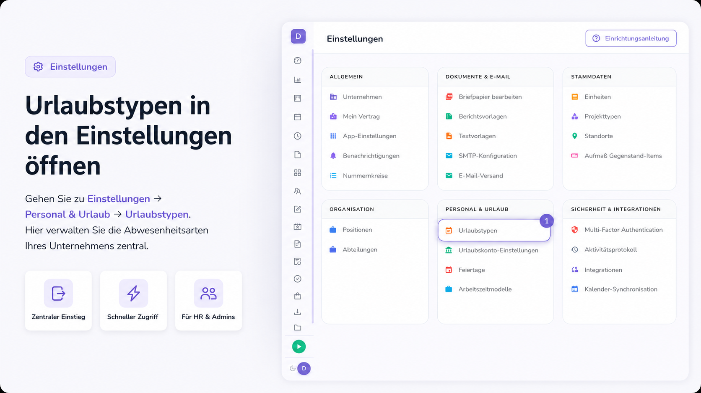
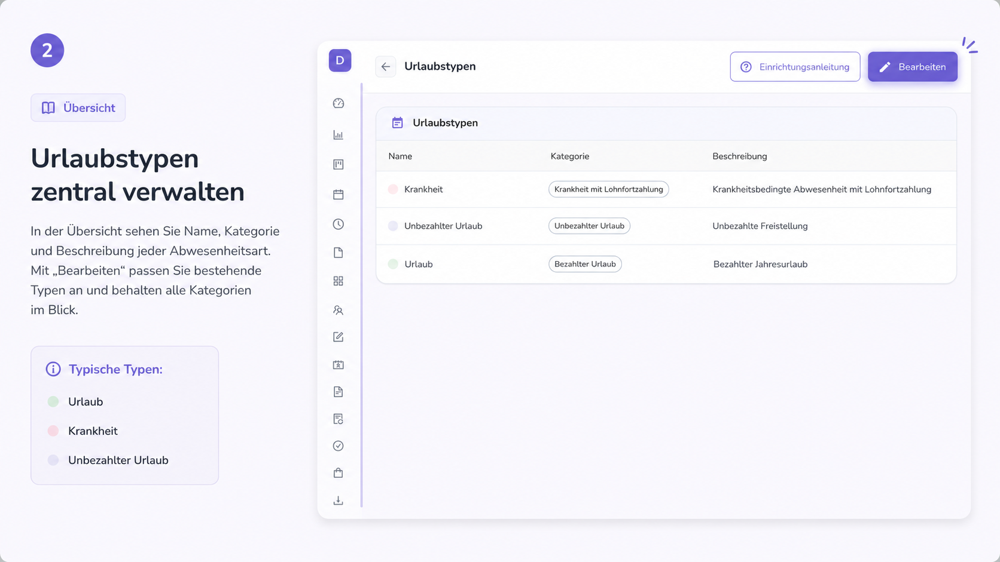
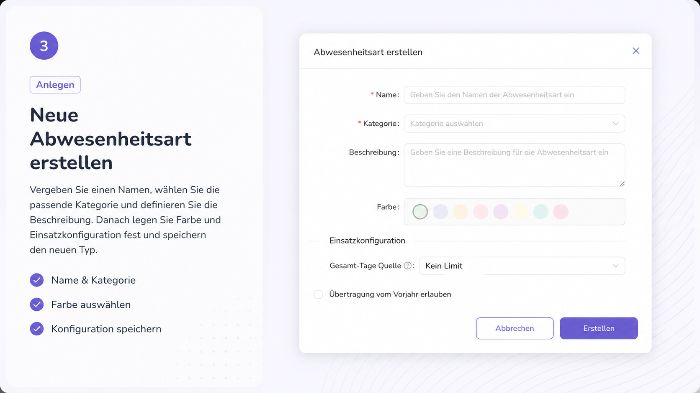

# Abwesenheiten

> **Menüpunkt in der App:** **Abwesenheiten**  
> **Lesezeit:** ca. 15 Minuten  
> **Verfügbar in:** Web, teilweise Mobile App  
> **Für:** Mitarbeiter, Teamleitung, HR und Verwaltung

---

## Kurz erklärt

Mit **Abwesenheiten** in Planvo melden Sie Urlaub, Krankheit und andere Fehlzeiten digital. Sie sehen Ihr **Urlaubskonto**, stellen **Anträge** und — wenn Sie dafür zuständig sind — prüfen und geben Sie Anträge frei.

Administratoren richten unter **Einstellungen** die **Urlaubstypen** ein. Diese erscheinen dann in Anträgen und Kalendern.

!!! note "Kein Menüpunkt Abwesenheiten?"
    Fragen Sie Ihre Administration, ob das Modul für Ihr Unternehmen freigeschaltet ist und ob Sie Zugriff darauf haben.

---

## Abwesenheitsverwaltung

Öffnen Sie in der Seitenleiste **Abwesenheiten**. Oben rechts legen Sie jederzeit einen neuen Antrag an: **+ Neuen Abwesenheitsantrag**.

---

### Monatsübersicht

Unter **Übersicht** sehen Sie, wer im Team wann abwesend ist — als Monats- oder Wochenkalender.

| Bereich | Erklärung |
|---------|-----------|
| Mitarbeiterliste | Links: Name und Bereich |
| Kalender | Rechts: Tage des Monats |
| Farbige Balken | Abwesenheiten als Zeiträume |
| Kürzel | z. B. **UR** = Urlaub, **K** = Krankheit, **UN** = unbezahlter Urlaub |
| Heute | Springt zum aktuellen Tag |
| Monat / Woche | Ansicht umschalten |

Mit den **Pfeilen** wechseln Sie den Monat, mit **Heute** zurück zum heutigen Datum.

!!! info "Nur Ihr eigener Kalender?"
    Sehen Sie unter **Übersicht** nur Ihren persönlichen Jahreskalender, ist die Team-Monatsübersicht für Ihre Rolle nicht freigeschaltet. Führungskräfte und HR sehen die Team-Ansicht wie im Screenshot.

---

### Jahreskalender

Unter **Jahreskalender** planen Sie langfristig: ein ganzes Jahr auf einen Blick.

| Funktion | Nutzen |
|----------|--------|
| Jahresansicht | Urlaubshäufungen und Engpässe erkennen |
| Feiertage | Automatisch markiert |
| Wochenenden | Optisch abgesetzt |
| Farben & Legende | Urlaub, Krankheit, unbezahlter Urlaub unterscheidbar |

**Tipp:** Tag anklicken oder Zeitraum ziehen, dann **Urlaubsantrag** — das Formular öffnet sich mit den gewählten Daten.

---

### Anträge prüfen und freigeben

Unter **Anträge** finden Sie alle Abwesenheitsanträge in einer Tabelle.

| Spalte | Bedeutung |
|--------|-----------|
| Mitarbeiter | Wer den Antrag gestellt hat |
| Abwesenheitstyp | z. B. Urlaub, Krankheit |
| Dauer | Zeitraum und Anzahl Tage |
| Status | Ausstehend, freigegeben oder abgelehnt |
| Notizen | Zusätzliche Hinweise |
| Antrag & Freigabe | Wann gestellt und von wem bearbeitet |
| Aktionen | Freigeben, ablehnen oder stornieren |

| Status | Bedeutung |
|--------|-----------|
| Ausstehend | Wartet auf Entscheidung |
| Freigegeben | Genehmigt — erscheint im Kalender und Urlaubskonto |
| Abgelehnt | Nicht genehmigt |
| Storniert | Zurückgezogen |

Nutzen Sie **Anträge suchen…** und **Alle Status**, um die Liste einzugrenzen.

Als Vorgesetzte/r oder HR können Sie bei ausstehenden Anträgen **freigeben** (Haken) oder **ablehnen** (X). Bereits freigegebene Anträge lassen sich unter Umständen **stornieren** — dafür ist oft ein Grund nötig.

---

### Abwesenheit beantragen

Klicken Sie auf **+ Neuen Abwesenheitsantrag** oder wählen Sie im Kalender **Urlaubsantrag**.

| Feld | Erklärung |
|------|-----------|
| Mitarbeiter | HR kann für andere eintragen; sonst Ihr eigenes Profil |
| Abwesenheitsart | z. B. Urlaub oder Krankheit |
| Zeitraum | Start und Ende; Planvo zählt die **Arbeitstage** (ohne Samstag und Sonntag) |
| Notizen | Optional, z. B. Vertretung oder Begründung |

Bei **Urlaub** sehen Sie Ihr verfügbares Urlaubskonto. Reicht es nicht, erscheint eine Hinweis — Sie können den Antrag oft trotzdem einreichen.

Mit **Antrag stellen** senden Sie den Antrag ab. Er hat zunächst den Status **Ausstehend**, bis Teamleitung, HR oder Admin entscheidet.

---

### Urlaubskonto

Unter **Urlaubskonto** sehen Sie Anspruch, Verbrauch und Resturlaub.

| Karte | Erklärung |
|-------|-----------|
| Urlaubsanspruch | Ihre Urlaubstage im Jahr |
| Genommene Tage | Bereits genutzt |
| Verfügbar | Noch planbar |
| Resturlaub Vorjahr | Übertrag aus dem Vorjahr |
| Ausstehend | Beantragt, noch nicht entschieden |

Die Tabelle darunter rechnet das im Detail nach. Über **Jahresübersicht** und **Bearbeitungshistorie** sehen Sie andere Jahre bzw. Änderungen.

---

### Abwesenheiten auswerten

Für HR und Verwaltung: Kennzahlen zum gesamten Unternehmen finden Sie unter **Auswertung**, nicht unter Abwesenheiten.

**Weg:** Seitenleiste → **Auswertung** → **Abwesenheitsauswertung**

| Bereich | Erklärung |
|---------|-----------|
| Kennzahlen | z. B. Mitarbeiter, Resturlaub, Krankentage |
| Krankenstand pro Monat | Diagramm nach Monaten |
| Abwesenheitstypen | Verteilung nach Art |
| Urlaubsstand | Tabelle je Mitarbeiter |
| Export | Excel-Datei herunterladen |

Weitere Details: [Auswertung (Web)](auswertung.md).

---

## Urlaubstypen einrichten

**Für HR und Admins:** Hier legen Sie fest, welche Abwesenheitsarten Mitarbeiter wählen können (z. B. Urlaub, Krankheit, unbezahlter Urlaub).

Im Bereich **Personal & Urlaub** gibt es außerdem **Urlaubskonto-Einstellungen**, **Feiertage** und **Arbeitszeitmodelle**.

---

### Urlaubstypen öffnen

1. **Einstellungen** in der Seitenleiste  
2. **Personal & Urlaub**  
3. **Urlaubstypen**

---

### Urlaubstypen verwalten

In der Tabelle sehen Sie **Name**, **Kategorie** und **Beschreibung** jeder Abwesenheitsart — mit Farbpunkt zur schnellen Erkennung im Kalender.

Mit **Bearbeiten** passen Sie bestehende Typen an oder legen neue an.

---

### Neue Abwesenheitsart anlegen

| Feld | Erklärung |
|------|-----------|
| Name | Bezeichnung im Antrag, z. B. „Sonderurlaub“ |
| Kategorie | z. B. Bezahlter Urlaub, Krankheit mit Lohnfortzahlung |
| Beschreibung | Kurzer Hinweis für HR (optional) |
| Farbe | Farbe im Kalender |
| Gesamt-Tage Quelle | z. B. Kein Limit oder Anbindung ans Urlaubskonto |
| Übertragung vom Vorjahr | Ob Resturlaub übernommen werden darf |

Mit **Erstellen** speichern — der Typ steht sofort bei neuen Anträgen zur Auswahl.

!!! warning "Typ wird schon genutzt?"
    Löschen oder stark ändern ist schwierig, wenn der Typ bereits in Anträgen vorkommt. Nutzen Sie dann **Bearbeiten**.

---

## Auch woanders in Planvo

- **Mitarbeiter** → Profil → **Abwesenheit** — Urlaubskonto und Anträge einer Person  
- **Mobile App** — Antrag unterwegs stellen  
- **Dashboard** — aktuelle Abwesenheiten (je nach Rolle)

---

## Häufige Fragen

### Kann ich einen ausstehenden Antrag ändern?

Nein. **Stornieren** Sie den Antrag und legen Sie einen **neuen** an.

### Was passiert nach der Freigabe?

Der Eintrag erscheint in **Übersicht** und **Jahreskalender**; das **Urlaubskonto** wird aktualisiert.

### Warum sehe ich keine Team-Monatsübersicht?

Dann ist für Sie nur der **persönliche Kalender** freigeschaltet. Die Team-Ansicht sehen Führungskräfte und HR.

### Wer darf Urlaubstypen anlegen?

In der Regel HR und Administratoren über **Einstellungen** → **Urlaubstypen**.

### Welchen Abwesenheitstyp soll ich wählen?

Die Liste legt Ihr Unternehmen fest. Bei Unklarheit: Personalabteilung oder Vorgesetzte.

---

## Hilfe & Support

--8<-- "includes/kontakt-ssot.md"

---

## Verwandte Themen

- [Auswertung](auswertung.md)
- [Schichtpläne](schichten.md)
- [Mobile App](../mobile/index.md)
