# Zeiterfassung (Web)

> **⏱️ Lesezeit:** 12 Minuten  
> **📱 Verfügbar in:** Web (ergänzend: [Zeiterfassung Mobile](../mobile/zeiterfassung.md))  
> **👤 Für:** Mitarbeitende, Projektleitung, Personal (je nach Berechtigung)

---

## 📋 Was Sie in diesem Kapitel lernen

- ✅ Wo **Administratoren** die **App-Einstellungen für die Zeiterfassung** anpassen
- ✅ Wo Sie **Projektzeiten** erfassen und die **Kalenderansicht** nutzen
- ✅ Wie Sie **Einträge im Kalender** bearbeiten, verschieben und neu anlegen
- ✅ Wie der Dialog **Projektzeit erfassen** funktioniert (inkl. **Pausen**)
- ✅ Wo Sie **Zeiteinträge als Liste** sehen, **exportieren** und das **Stundenkonto** nutzen
- ✅ Wie die **Auswertung** (Menüpunkt) zu Diagrammen und weiteren Tabs führt

---

## 🎯 Übersicht

In Planvo erfassen Sie Arbeitszeit in der Regel als **Projektzeit**: Sie wählen ein **Projekt** (sofern vorgesehen), **Datum**, **Start- und Endzeit** und können **Pausen** und **Bemerkungen** hinzufügen.

Zwei zentrale Menüpunkte in der Web-App:

| Menüpunkt | Route (URL) | Zweck |
|-----------|-------------|--------|
| **Zeiterfassung** | `/project-time` | Kalender, schnelles Erfassen, Tabs **Zeiteinträge** und **Stundenkonto** |
| **Auswertung** | `/analyse` | Auswertungen, Tabellen, Diagramme, ggf. Finanzen und Abwesenheiten |

!!! info "Berechtigungen"
    Was Sie sehen, hängt von Ihrer **Rolle** ab: Nur eigene Zeiten, alle Mitarbeiter, Export für das Team oder zusätzliche Tabs (z. B. **Finanzen**, **Abwesenheitsauswertung**) sind möglich. Fehlt ein Menüpunkt, wenden Sie sich an Ihre Administration.

---

## App-Einstellungen: Zeiterfassung (Administratoren)

**Weg:** **Einstellungen** (Seitenleiste oder Zahnrad) → **App-Einstellungen** → Karte bzw. Abschnitt **Zeiterfassung**

Hier legen Sie **unternehmensweite Regeln** fest. Sie wirken auf die Zeiterfassung in **Web** und **App**, soweit die jeweilige Oberfläche die Option unterstützt. Oben können Sie über **Bearbeiten** in den Änderungsmodus wechseln; die **Einrichtungsanleitung** führt bei Bedarf durch weitere Schritte.

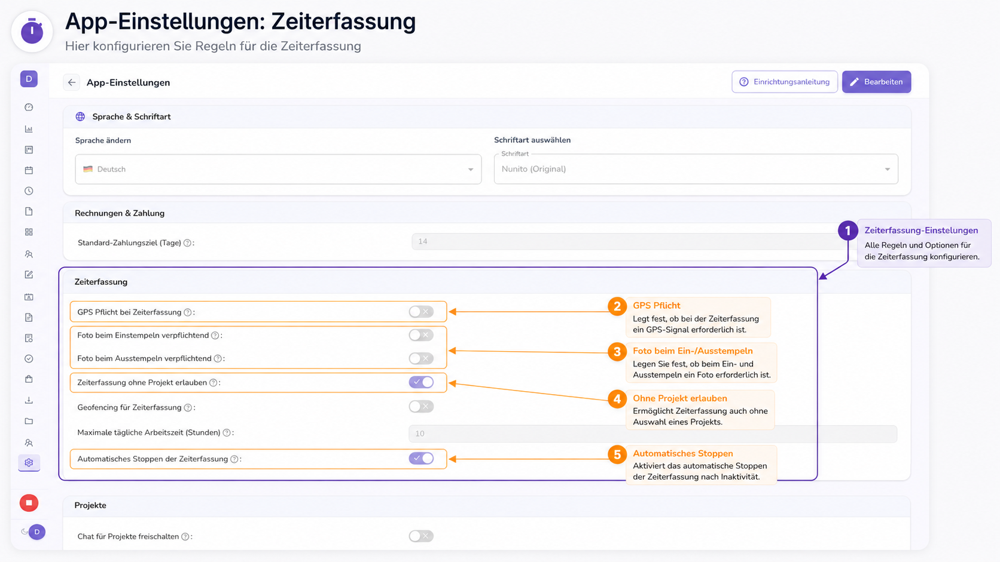

| Einstellung | Kurz erklärt |
|-------------|----------------|
| **GPS Pflicht bei Zeiterfassung** | Wenn aktiv, ist beim Stempeln ein **GPS-Signal** erforderlich (sinnvoll für Außendienst, abhängig von Datenschutz und Vereinbarung). |
| **Foto beim Einstempeln / Ausstempeln verpflichtend** | Erzwingt ein **Foto** beim Start bzw. Ende der Zeiterfassung (z. B. für Nachweise). |
| **Zeiterfassung ohne Projekt erlauben** | Erlaubt Einträge **ohne gewähltes Projekt** — praktisch, wenn nicht jede Tätigkeit einem Projekt zugeordnet ist. |
| **Automatisches Stoppen der Zeiterfassung** | Beendet die laufende Erfassung nach **Inaktivität** automatisch (Schutz vor vergessenem Ausstempeln). |
| **Geofencing für Zeiterfassung** | Einschränkung der Erfassung auf **definierte Bereiche** (wenn in Ihrer Umgebung eingerichtet). |
| **Maximale tägliche Arbeitszeit** | Obergrenze in **Stunden** pro Tag (Beispiel: 10 h) — je nach Auswertung und Hinweisen in der App. |

!!! warning "Nur für Berechtigte"
    Diese Seite sehen und ändern nur **Administratoren** bzw. Rollen mit Zugriff auf **App-Einstellungen**. Änderungen können sich auf **alle Mitarbeitenden** auswirken — kurz mit dem Team abstimmen.

---

Die folgenden **10 Schritte** zeigen die **Zeiterfassung im Alltag** (Kalender, Einträge, Export). Screenshots: `zeiterfassung1.png` … `zeiterfassung10.png`.

---

## Schritt 1 – Navigation: Zeiterfassung und Auswertung

**Weg:** In der **linken Seitenleiste** den Bereich **Projekte & Planung** aufklappen.

Dort finden Sie u. a.:

- **Zeiterfassung** → Kalender, Zeiteinträge, Stundenkonto  
- **Auswertung** → Kennzahlen und Diagramme (siehe Text am Ende dieses Kapitels)

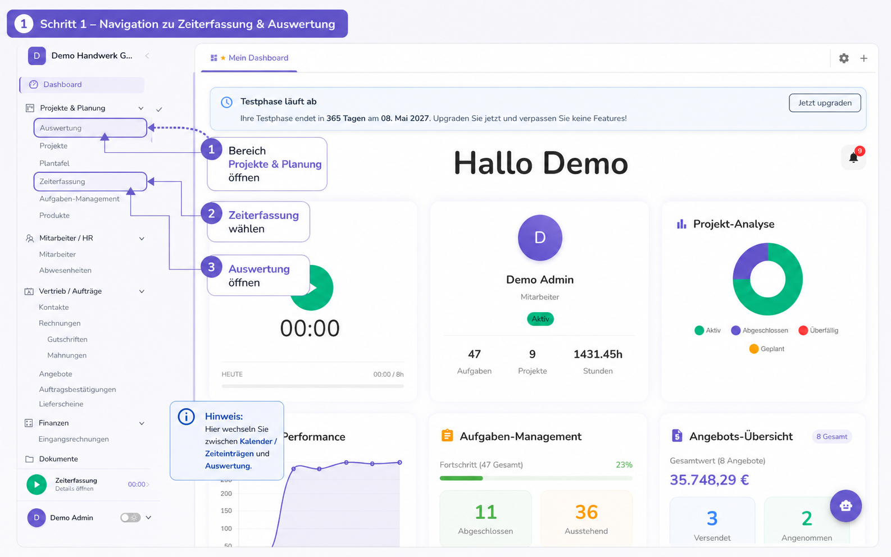

**Was Sie hier sehen:** Wo Sie zwischen **Kalender/Zeiteinträgen** und der **Auswertung** wechseln.

---

## Schritt 2 – Seite „Zeiterfassung“: die drei Tabs

Öffnen Sie **Zeiterfassung**. Oben gibt es bis zu **drei Register**:

| Tab | Inhalt |
|-----|--------|
| **Zeiterfassung** | Kalender (**Monat**, **Woche**, **Tag**) mit Ihren Blöcken |
| **Zeiteinträge** | Listenansicht mit Filtern, Bearbeiten/Löschen (soweit erlaubt), **Export** |
| **Stundenkonto** | Übersicht zum Stundenkonto; bei Berechtigung zusätzlich **Team-Übersicht** |

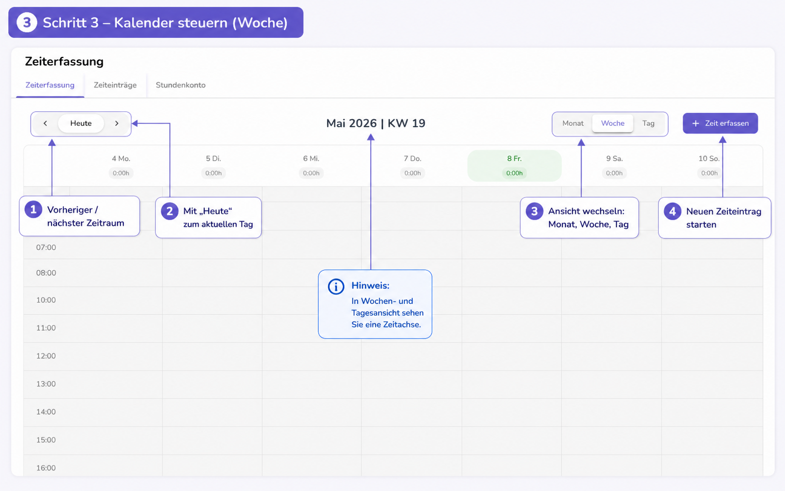

Oben rechts kann je nach Berechtigung **+ Zeit erfassen** erscheinen — derselbe Dialog wie bei **Neuer Eintrag** in der Listenansicht.

---

## Schritt 3 – Kalender steuern (Woche, Monat, Tag)

Im Tab **Zeiterfassung** steuern Sie den Kalender mit:

- **Pfeil links / rechts** – vorheriger oder nächster Zeitraum  
- **Heute** – Sprung zum aktuellen Tag  
- **Monat**, **Woche**, **Tag** – Umschalten der Ansicht  

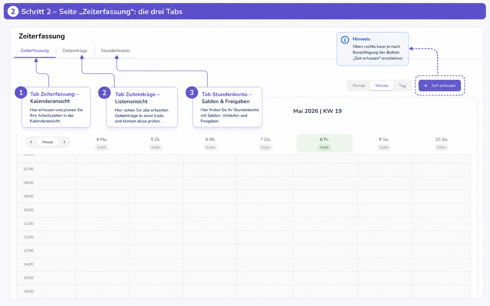

In der **Wochen-** und **Tagesansicht** sehen Sie eine **Zeitachse** (in der Regel in **Viertelstunden**). Nach unten scrollen, um spätere Uhrzeiten zu sehen.

---

## Schritt 4 – Zeiteinträge im Kalender

In **Woche** oder **Tag** erscheinen gebuchte Zeiten als **farbige Blöcke** auf der Zeitachse.

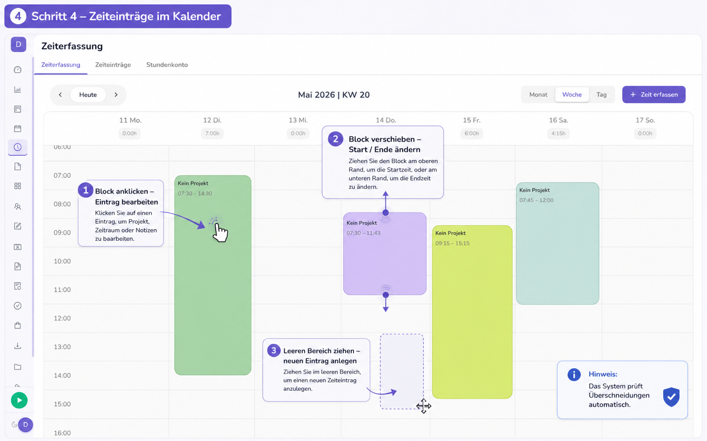

**Typische Aktionen (wenn Ihre Rolle es erlaubt):**

- **Block anklicken** – Eintrag bearbeiten (Projekt, Zeitraum, Notizen)  
- **Obere / untere Kante ziehen** – **Startzeit** bzw. **Endzeit** ändern  
- **Leeren Bereich auf der Achse ziehen** – neuen Zeiteintrag für dieses Zeitfenster anlegen  

Das System prüft **Überschneidungen** automatisch. Wenn eine Aktion fehlt, fehlt oft die **Schreibberechtigung** für Zeiteinträge.

**Monatsansicht:** Über **Monat** sehen Sie den Überblick pro Tag; von dort wechseln Sie bei Bedarf in **Woche** oder **Tag** für Details.

---

## Schritt 5 – Neuen Eintrag starten (zwei Wege)

Sie können dieselbe **Projektzeit** auf zwei Arten beginnen:

1. **Im Kalender:** Button **+ Zeit erfassen** (rechts in der Kalenderleiste)  
2. **In der Liste:** Tab **Zeiteinträge** → **+ Neuer Eintrag** (neben **Export**)

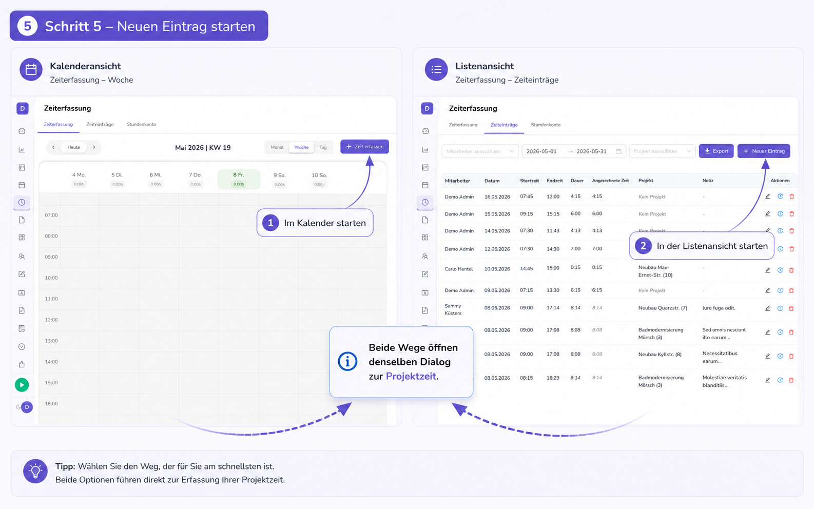

Beide Wege öffnen **denselben Dialog** „Projektzeit erfassen“.

---

## Schritt 6 – Dialog „Projektzeit erfassen“: Projekt und Zeiten

Im Dialog legen Sie fest:

1. **Mitarbeiter** – nur sichtbar, wenn Sie Einträge für andere anlegen dürfen; sonst gilt der Eintrag für **Sie**  
2. **Projekt** – Auswahl aus den aktiven Projekten (Pflicht, sofern Ihre Firma keine projektfreie Erfassung erlaubt)  
3. **Datum**  
4. **Start** und **Ende** (Uhrzeit)  

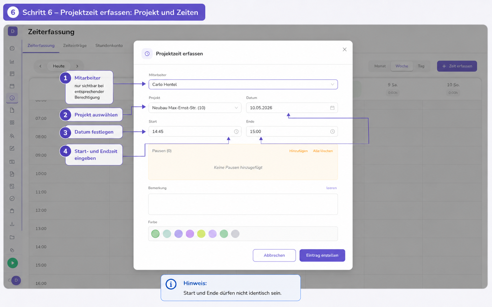

**Hinweis:** **Start** und **Ende** dürfen **nicht identisch** sein. **Nachtschicht:** Endzeit kann „früher“ als die Startzeit sein — das System wertet das als Ende am **Folgetag**.

---

## Schritt 7 – Pausen, Bemerkung und Farbe

Im unteren Teil des Dialogs:

- **Pausen** – **Hinzufügen** für Unterbrechungen, **Alle löschen** zum Entfernen; Pausen werden von der Bruttozeit abgezogen  
- **Bemerkung** – freier Text; **leeren** löscht den Text  
- **Farbe** – Darstellung des Blocks im Kalender  
- **Eintrag erstellen** / **Aktualisieren** – speichern; **Abbrechen** schließt ohne Speichern  

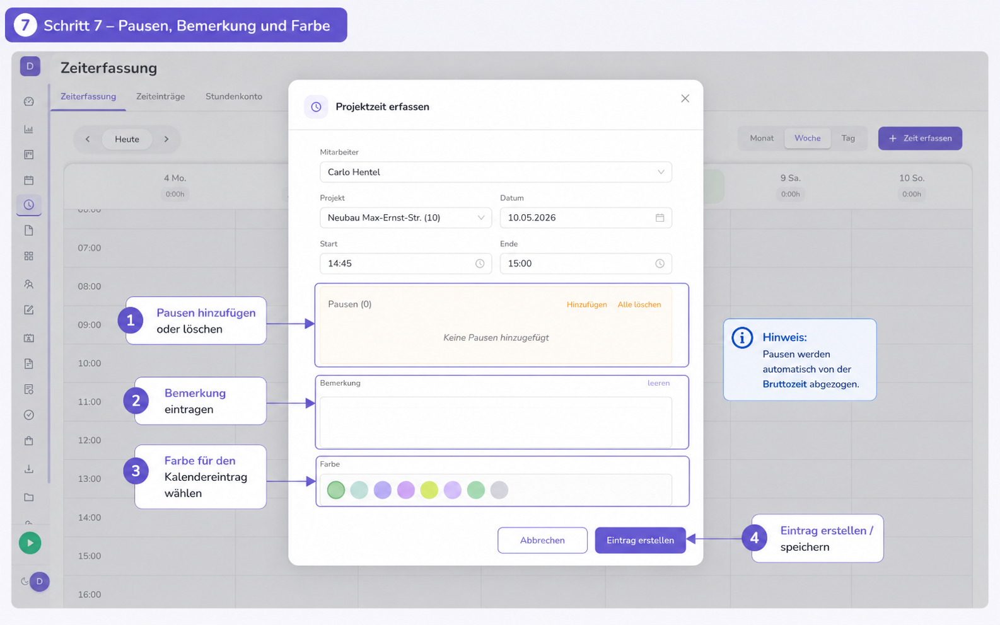

!!! tip "GoBD / Korrekturen"
    Wenn Ihre Organisation das vorsieht, kann beim **Bearbeiten** ein **Korrekturgrund** Pflicht sein.

---

## Schritt 8 – Tab „Zeiteinträge“ (Liste)

Unter **Zeiteinträge** filtern Sie nach **Mitarbeiter**, **Zeitraum** und **Projekt** und sehen alle Einträge in einer **Tabelle**.

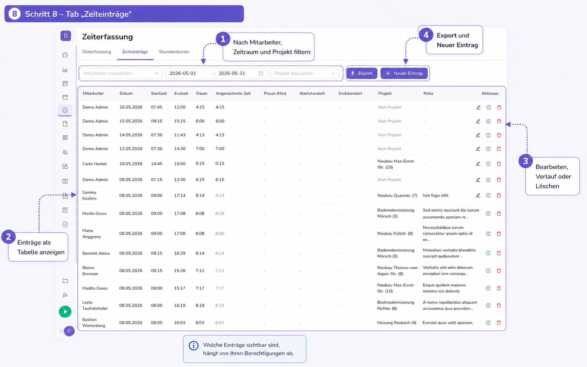

Typische Spalten (je nach Konfiguration): Mitarbeiter, Datum, Start, Ende, Dauer, angerechnete Zeit, Pause, Standort, Projekt, Notiz.

**Aktionen** pro Zeile (soweit erlaubt): **Bearbeiten**, **Verlauf** (Historie), **Löschen**. Oben: **Export** und **+ Neuer Eintrag**.

!!! info "Sichtbarkeit"
    Welche Zeilen Sie sehen, hängt von Ihren **Berechtigungen** ab (nur eigene Zeiten vs. Team).

---

## Schritt 9 – Export als PDF oder CSV

**Export** öffnet den Dialog **Monatsbericht exportieren**:

1. **Monat** wählen (Pflicht)  
2. Optional **Mitarbeitende** auswählen — leer bedeutet in der Regel **alle** (nur mit passender Berechtigung)  
3. Format: **PDF** (Übersicht zum Archiv/Druck) oder **CSV** (Excel und weitere Programme)  
4. **Export** starten und die Datei speichern  

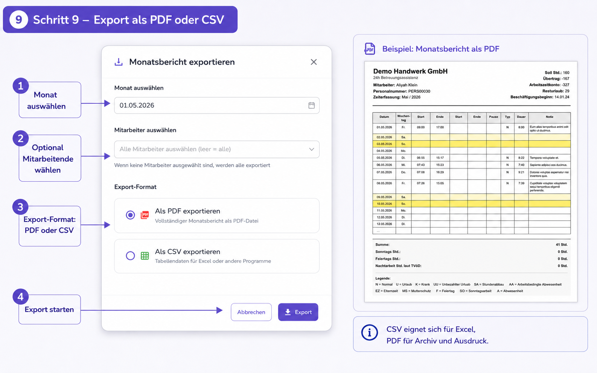

!!! note "Viele Mitarbeitende"
    Exporte für **viele Personen** können etwas dauern; ein Fortschrittshinweis kann erscheinen.

---

## Schritt 10 – Stundenkonto verstehen

Im Tab **Stundenkonto** sehen Sie Ihre **Soll- und Ist-Stunden**, **Salden** (Anfang, Ende, Status) und können einen Monat ggf. **freigeben** (**Monat freigeben**), sofern das in Ihrem Prozess vorgesehen ist.

Mit erweiterter Berechtigung erscheint **Team Übersicht**: Kennzahlen zum Team (Mitarbeiterzahl, durchschnittlicher Saldo, Freigaben, negative Salden) und eine Tabelle **Saldo pro Mitarbeiter** inkl. **Freigabestatus**.

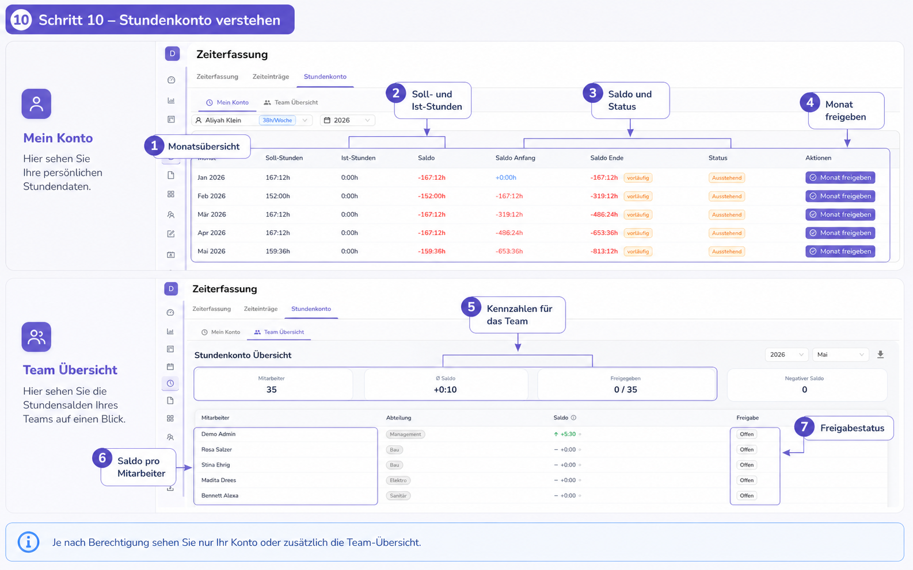

Je nach Rolle sehen Sie **nur Ihr Konto** oder zusätzlich die **Team-Übersicht**.

---

## Auswertung (Menüpunkt) – Diagramme und weitere Tabs

Unter **Projekte & Planung** → **Auswertung** (`/analyse`) finden Sie je nach Recht u. a.:

- Tab **Auswertung** – Filter (Mitarbeiter, Zeitraum, Projekt), Karten mit **Gesamtstunden**, **Arbeitstagen**, **Einträgen**, **Ø Stunden/Tag** sowie Diagramme (**Stunden pro Tag**, **Verteilung nach Projekt** / **Mitarbeiter**)  
- Weitere Register: z. B. **Zeiterfassung** (Liste), **Stundenkonto**, **Finanzen** (mit Rechnungsmodul), **Abwesenheitsauswertung**

Für **Urlaub** und **Krankheit** siehe [Urlaubsverwaltung](urlaub.md).

---

## Weitere Tabs unter „Auswertung“ (Kurzüberblick)

| Tab | Kurzbeschreibung |
|-----|------------------|
| **Zeiterfassung** | Listenansicht ähnlich **Zeiteinträge** auf der Seite Zeiterfassung |
| **Stundenkonto** | Wie auf `/project-time`, abhängig von `auswertung.stundenkonto` |
| **Finanzen** | Nur mit Rechnungsmodul |
| **Abwesenheitsauswertung** | HR-Kennzahlen zum Jahr |

---

## Dashboard: Live-Zeiterfassung (optional)

Auf dem **Dashboard** kann ein Widget **Zeiterfassung** angezeigt werden: **Start**, **Pause** und **Stopp** — optional mit **GPS**, wenn Ihre Organisation das vorsieht.

Das Widget **ergänzt** die Projektzeit im Kalender; Auswertungen beziehen sich auf die gespeicherten **Zeiteinträge**.

---

## 🔄 Kurze Szenarien

=== "Einen Arbeitstag im Kalender buchen"

    1. **Zeiterfassung** öffnen → **Woche** oder **Tag** wählen  
    2. **+ Zeit erfassen** oder Bereich **ziehen**  
    3. **Projekt**, **Datum**, **Start**, **Ende** wählen, ggf. **Pausen** und **Bemerkung**  
    4. Speichern — der Block erscheint im Kalender  

=== "Monatsbericht als PDF"

    1. **Zeiterfassung** → Tab **Zeiteinträge**  
    2. **Export** → Monat wählen → **PDF** → herunterladen  

=== "Stunden pro Projekt im Quartal sehen"

    1. Menü **Auswertung**  
    2. Zeitraum setzen, optional **Projekt** wählen  
    3. Diagramm **Stundenverteilung nach Projekt** prüfen  

---

## ❓ Häufige Fragen

??? question "Warum kann ich keinen Eintrag speichern?"
    Häufig fehlt das **Projekt**, **Start** und **Ende** sind identisch, oder es gibt eine **Überschneidung**. Die Meldung im Dialog oder unten am Bildschirm nennt die Ursache.

??? question "Warum sehe ich andere Mitarbeiter nicht?"
    Dann ist Ihr Konto auf **eigene Zeiten** beschränkt. Ihre Administration kann erweiterte Leserechte vergeben.

??? question "Was ist der Unterschied zwischen Zeiterfassung und Auswertung?"
    **Zeiterfassung** (`/project-time`) ist der **Kalender** inkl. Liste und Stundenkonto. **Auswertung** (`/analyse`) bündelt **Statistik** und je nach Rolle weitere Tabs.

??? question "Gibt es eine Tastenkombination zum Stempeln?"
    Die Web-Oberfläche nutzt vor allem **Kalender** und **Dialoge**. Für Live-Zeit nutzen Sie ggf. das **Dashboard-Widget**.

---

## 📋 Schnell-Referenz

| Aufgabe | Weg |
|---------|-----|
| Regeln für Zeiterfassung (Firma) | **Einstellungen** → **App-Einstellungen** → **Zeiterfassung** |
| Zeit im Kalender buchen | **Zeiterfassung** → Tab **Zeiterfassung** → **+ Zeit erfassen** / im Raster ziehen |
| Einträge als Liste | **Zeiterfassung** → Tab **Zeiteinträge** |
| PDF/CSV-Export | **Zeiteinträge** → **Export** |
| Stundenkonto | **Zeiterfassung** → Tab **Stundenkonto** |
| Diagramme / Summen | Menü **Auswertung** |
| Mobile Stempelung | [Zeiterfassung Mobile](../mobile/zeiterfassung.md) |

---

## 🆘 Brauchen Sie Hilfe?

-   :material-chat:{ .lg } **Live-Chat**

    ---

    Schnelle Antworten während der Geschäftszeiten

    [Chat öffnen](https://www.planvo.de)

-   :material-email:{ .lg } **E-Mail Support**

    ---

    Detaillierte Anfragen per E-Mail

    [support@planvo.de](mailto:support@planvo.de)

---

*Letzte Aktualisierung: Mai 2026 | Version 3.2 (App-Einstellungen + 10 Schritte)*
